

  

I work with **Kinaxis** on the **AI Platform team**. Outside work, I build games and mods as **GreatColtini Industries**.

  
  
  

## Games by GreatColtini Industries

Building the next adventure. Play the last one today.

<table>
<tr>
<td colspan="2" valign="top">
<a href="https://store.steampowered.com/app/4990780/Kingdom_TD_Draft_Your_Demise/">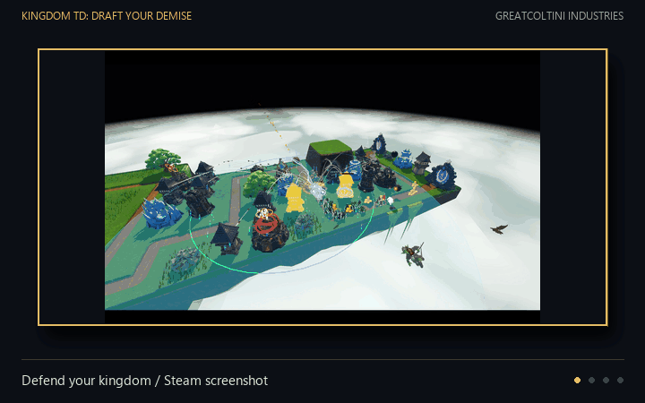</a>

<strong>IN DEVELOPMENT · GODOT · TOWER DEFENSE + CARD DRAFT</strong>

<h3>Kingdom TD: Draft Your Demise</h3>

Draft your enemies. Build your defenses. Decide what comes down the path.

<strong><a href="https://store.steampowered.com/app/4990780/Kingdom_TD_Draft_Your_Demise/">Explore on Steam →</a></strong>

</td>
</tr>
<tr>
<td width="36%" valign="middle">
<a href="https://store.steampowered.com/app/3629280/Lone_Survivors/">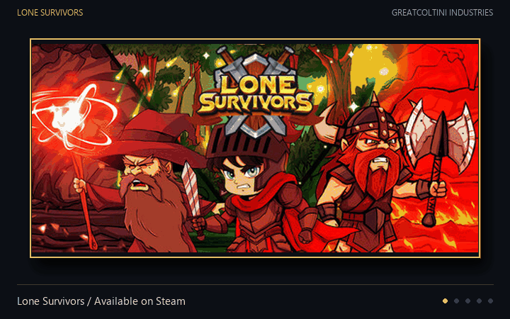</a>
</td>
<td width="64%" valign="middle">

<strong>RELEASED · GODOT · SURVIVORS-LIKE</strong>

<h3>Lone Survivors</h3>

Survive the horde with weapon synergies, distinct classes, and one more run.

<strong><a href="https://store.steampowered.com/app/3629280/Lone_Survivors/">Play on Steam →</a></strong>

</td>
</tr>
</table>

## Community creations

<table>
<tr>
<td width="50%" valign="top">
<a href="https://steamcommunity.com/sharedfiles/filedetails/?id=3759385002">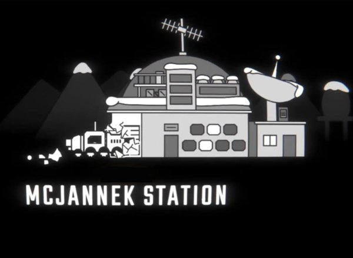</a>
<h3>McJannek Station — R.E.P.O</h3>

<strong>240,000+ Workshop subscribers</strong>

My R.E.P.O-inspired map for MECCHA CHAMELEON.

<a href="https://steamcommunity.com/sharedfiles/filedetails/?id=3759385002">View on Steam Workshop →</a>

</td>
<td width="50%" valign="top">
<a href="https://www.raftmodding.com/mods/shark-meat-from-shark-head">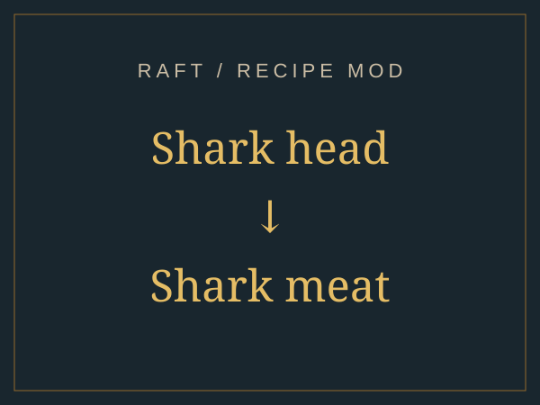</a>
<h3>Shark Meat From Shark Head</h3>

<strong>Raft · Utility mod</strong>

Turn spare shark heads into food with a simple crafting recipe.

<a href="https://www.raftmodding.com/mods/shark-meat-from-shark-head">View on RaftModding →</a>

</td>
</tr>
<tr>
<td width="50%" valign="top">
<a href="https://valheim.hexium.gg/mods/GreatColtini/CloserMiniBiomes">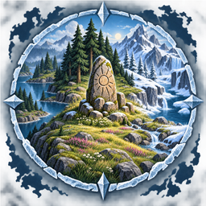</a>
<h3>CloserMiniBiomes</h3>

<strong>Valheim · World generation</strong>

Bring Valheim's alternative mini-biomes closer to the world spawn.

<a href="https://valheim.hexium.gg/mods/GreatColtini/CloserMiniBiomes">View on Hexium →</a>

</td>
<td width="50%" valign="top">
<a href="https://thunderstore.io/c/repo/p/GreatColtini/MinecraftAdditions/">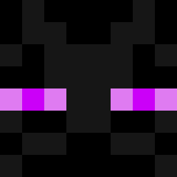</a>
<h3>Minecraft Additions</h3>

<strong>R.E.P.O. · Monsters &amp; valuables</strong>

Bring the Enderman, diamonds, Nether Stars, and TNT into R.E.P.O.

<a href="https://thunderstore.io/c/repo/p/GreatColtini/MinecraftAdditions/">View on Thunderstore →</a> · Legacy mod

</td>
</tr>
<tr>
<td colspan="2" align="center">
<a href="https://steamcommunity.com/sharedfiles/filedetails/?id=3732508344">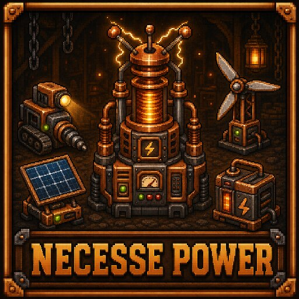</a>
<h3>Necesse Power</h3>

<strong>Necesse · Power networks &amp; automation</strong>

Build a power grid with generators, batteries, towers, and automated mining.

<a href="https://steamcommunity.com/sharedfiles/filedetails/?id=3732508344">View on Steam Workshop →</a>

</td>
</tr>
</table>

More experiments: [Surviving the Wilds](https://github.com/greatcoltini/game_website) · [Finance](https://github.com/greatcoltini/finance)

## The tools behind the work

**Cloud & infrastructure**

   

**Data platforms**

**Languages**

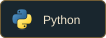 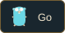 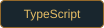 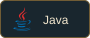 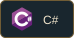 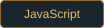 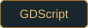

**Game development & modding**

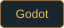 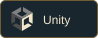 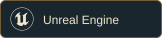

## After hours

Built from my GitHub contributions, updated daily.

---

**Colton Donkersgoed · GreatColtini Industries**
